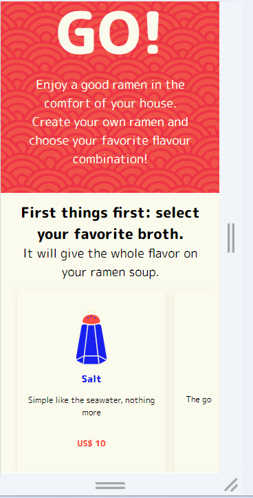
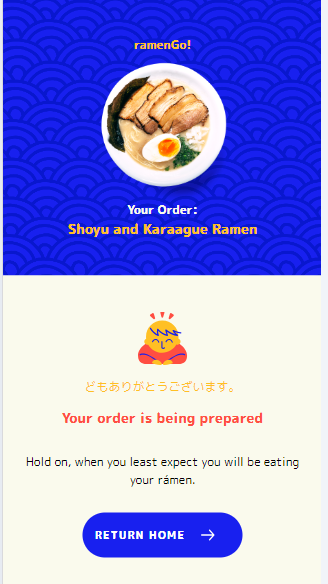
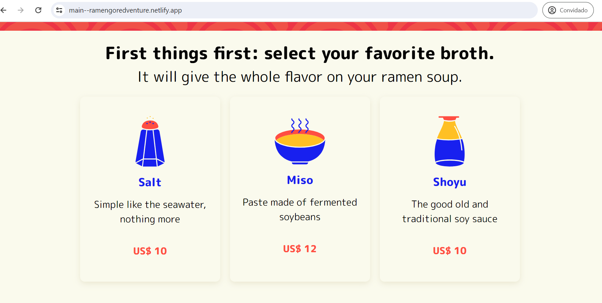

<h1 align="center">
      <a href="#" alt="Sistema RamenGo">Sistema RamenGo</a>
</h1>
<h3 align="center">
    Um sistema para uma empresa fictícia de compra e venda de Ramens
</h3>
<p align="center">
  

  
  
  <a href="https://github.com/GustavoMolino59/RamenGo/commits/master">
    
  </a>
    
   
   
   
 <h4 align="center">
	🚧   Concluído 🚀 🚧
</h4>

Tabela de conteúdos
=================
<!--ts-->

* [Sobre o projeto](#sobre-o-projeto)
* [Funcionalidades](#Features)
* [Layout](#-layout)
     * [Mobile](#mobile)
     * [Web](#web)
* [Como executar o projeto](#Como-executar-o-projeto)
     * [Pré-requisitos](#pré-requisitos)
     * [Rodando a aplicação web (Servidor)](#user-content---rodando-o-back-end-servidor)
     * [Rodando a aplicação web (Front-End)](#user-content---rodando-o-front-end-servidor)
* [Documentação API](#-documentação-api)
* [Tecnologias](#-tecnologias)
* [Organização](#-organização)
* [Autor](#-autor)
<!--te-->

## 💻 Sobre o projeto
O projeto foi desenvolvido para a vaga de  Fullstack Engineer na empresa RedVentures e representa um sistema de alimentos fictício chamado RamenGo 

### Funcionalidades
- [x] Cadastro de Caldos
- [x] Edição de Proteins
- [x] Listagem de Caldos
- [x] Listagem de Proteins
- [x] Requisião de ordem com busca na API Externa
- [x] Trativa de erros dentro do backend

## 🎨 Layout

O Layout é baseado na estrutura do figma dado como base para o desenvolvimento. É totalmente responsivo e foi escrito totalmente em CSS e HTML. As classes do HTML foram fortemente baseadas no Bootstrap, a fim de facilitar o desenvolvimento, mas foram todas criadas, uma a uma, por mim.
### Mobile
<p align="center">
  

  
</p>

### Desktop
<p align="center">
  

  
</p>

### Deploy 

O deploy do projeto está alocado em
[FrontEnd](https://main--ramengoredventure.netlify.app/). 
[Backend](https://api-ramengo-27af.onrender.com). 


O backend é gratuito assim como o banco de dados. As requisições podem demorar a chegar e pos isso nenhuma imagem aparece. Aguarde um pouco até a requição finalizar, observe em Network as requisções ainda pendentes

<p align="center">
  
</p>

### Como executar o projeto
### Pré-requisitos
Antes de começar, você vai precisar ter instalado em sua máquina as seguintes ferramentas:
[Git](https://git-scm.com), [Node.js](https://nodejs.org/en/). 
[Docker](https://www.docker.com/products/docker-desktop/). 
Além disto é bom ter um editor para trabalhar com o código como [VSCode](https://code.visualstudio.com/)

Garanta que não tem NENHUM OUTRO PROCESSO consumindo as portas locahost:5173 e localhost:3333 e a porta localhost:5432 . Pois são as portas que o server e o front estão preparados para emitir comunicação e o container do banco de dados

### Clonando o projeto
```bash
# Clone este repositório
$ git clone <https://github.com/GustavoMolino59/RamenGo>

# Acesse a pasta do projeto no terminal/cmd
$ cd RamenGo
```

### Deixe o Docker Desktop aberto enquanto executa o backend Localmente
A aplicação está preparada em um só script para subir o container, fazer as migrations e abastecer o banco de dados manualmente

### 🎲 Rodando o Back End (servidor)
```bash
# Vá para a pasta API
$ cd api

# Instale as dependências
$ npm install

# Execute a aplicação em modo de desenvolvimento
$ npm run runningDev

# O servidor inciará na porta:3333 e o banco de dados na porta localhost:5432 - acesse <http://localhost:3333>
````

### 🎲 Rodando o Front End (web)
Agora com o Backend rodando, deixe-o rodando e vamos rodar nosso front-end

```bash
# Vá para a pasta web
$ cd web

# Instale as dependências
$ npm install

# Execute a aplicação em modo de desenvolvimento
$ npm run dev

# O servidor inciará na porta:5173 - acesse <http://localhost:5173>
````

Caso por algum motivo esse script não funcione, localmente pode-se rodar
```bash
# Vá para a pasta API
$ cd api

# Instale as dependências
$ npm install

# crie o container do Postgree
$ docker-compose up

# Roda a migration
$ npm run migrate

# Roda o Seeder
$ npm run dev:seed

# Rode o servidor
$ npm run start:dev

# O servidor inciará na porta:3333 e o banco de dados na porta localhost:5432 - acesse <http://localhost:3333>
````


Agora basta acessar no browser o endereço <http://localhost:5173> e você verá o sistema funcionando

## 🛠 Tecnologias

As seguintes ferramentas foram usadas na construção do projeto:

####**Server**  ([NodeJS](https://nodejs.org/en/) 

-   **[Fastify](https://fastify.dev/)**
-   **[Fastify-CORS](https://github.com/fastify/fastify-cors)**
-   **[Prisma](https://www.prisma.io/)**
-   **[Postgresql](https://www.postgresql.org/)**
-   **[dotENV](https://github.com/motdotla/dotenv)**
-   **[TypeScript](https://www.typescriptlang.org/)**
-   **[Vitest](https://vitest.dev/)**
-   **[Eslint](https://eslint.org/)**
> Veja o arquivo  [package.json](https://github.com/GustavoMolino59/RamenGo/blob/main/package.json)


####**Web** 

A aplicação Web foi desenvolvida integralmente com HTML, CSS e JavaScript, sem a incorporação de bibliotecas externas. Dada a restrição quanto ao uso de frameworks, a abordagem adotada foi a construção de um framework próprio. Isto implica em replicar as funcionalidades típicas de frameworks front-end, como a criação de componentes utilizando JavaScript e a renderização individualizada destes componentes. Dessa forma, qualquer alteração na interface de usuário provoca a re-renderização apenas do componente afetado, otimizando a performance da aplicaçã

### Documentação API
<p align="center">
  <a href="assets/Insomnia-Atech" target="_blank"></a>
</p>

### Organização

#### **Backend**
O Backend e totalmente feito em NodeJs.
A abordagem utizada foi de Clean Architecture, utilizando o Use-Case Pattern e o repository pattern. Garantindo total modularização e independência dos módulos do backend.
O Sistema conta com 3 controllers, que são responsáveis por Orders, Broths e Proteins, e cada controller chama os respectivos Use-Cases conforme necessário e fazem as tratativas de erros.

Todo o sistema é testavel com testes unitários, um para cada caso de uso, e completamente desacoplado do restante do sistema, usando um banco de dados InMemory que testa apenas o respectivo caso de uso
Banco de dados - Utiliza-se um banco de dados Postgree que está alocado no Render e localmente gera um conteiner docker de um banco de dados. O sistema se baseia no PRISMA para tratar das relações com o banco de dados

#### **Testes**

Todos os casos de uso são testaveis, utilizando o VITESTE e podem ser testados realizando o seguinte comandos:
```bash
# Vá para a pasta da API
$ cd api

# Rodar os testes
$ npm run test
```

#### **FrontEnd**
O front End é organizado em componentes. Os componente são orquestados por uma função chamada renderComponents(), elá é responsável por guardar os componentes e renderiza-los conforme necessidade e/ou mudanças nele.
Cada componente é responsável apenas pelas suas próprias funcionalidades, ou seja, fazem requisições e se adaptam conforme interação do usuário individualmente.
Eles tem uma classe chamada Render() que se autoRenderiza cada vez que há necessidade devido a interação.

A página inteira foi baseada no conceito de SPA(Single-Page Application), de modo que a mudança de tela não representa efetivamente uma mudaça de arquivo HTML e sim apenas uma renderização dos novos componentes via Javascript.

Os conceitos utilizados são os mesmos dos frameworks como React e Vue, mas com nivel de abstração mais baixo devido a dificuldade de criar um componente inteiro do zero

Foi criada também uma classe API que faz apenas os métodos GET e POST, que são necessários para o sistema. A API utiliza métodos nativos do Javascript como o fetch() e then()
### Autor
---
Feito por Gustavo Molino 👋🏽 Entre em contato!

[](https://www.linkedin.com/in/gustavo-molino/)

[](mailto:g247144@dac.unicamp.br)

